# TTT2 Incubator Role

A custom social-deduction role for [TTT2](https://docs.ttt2.neoxult.de/), built as a server addon for [Garry's Mod](https://store.steampowered.com/app/4000/Garrys_Mod/).

The **Incubator** appears to be an ordinary member of the Innocent team. Its ability only becomes visible after death: three seconds after the player is killed, a hostile mutant hatches from their corpse with a burst of blood and sound effects. The dead player leaves behind a new problem for everyone still trying to survive the round.

This repository is intentionally small. It is a focused Lua addon that adds one role, its event-driven server behaviour, localisation, audio, and an optional UI icon asset.

## The Game Context

No Garry's Mod knowledge is needed to understand the idea:

- **Garry's Mod** is a sandbox game with a large community addon ecosystem.
- **Trouble in Terrorist Town (TTT)** is a multiplayer social-deduction mode included with Garry's Mod. A small group of hidden Traitors must eliminate the Innocent players before they are discovered. The [official TTT overview](https://www.troubleinterroristtown.com/) describes it as a computer game similar to *Werewolf* or *Mafia*, but with guns.
- **TTT2** is an expanded version of TTT designed to support additional roles and other modular content.
- This addon introduces one hidden Innocent-side role to create a new moment of uncertainty: killing a player can make the round more dangerous rather than less.

## Gameplay Flow

```mermaid
flowchart LR
    A["Round starts"] --> B["A player receives the hidden Incubator role"]
    B --> C["The Incubator dies"]
    C --> D["Play a warning growl"]
    D --> E["Wait 3 seconds"]
    E --> F["Resolve the player's corpse position"]
    F --> G["Spawn one random Podbeg mutant"]
    G --> H["Play a splat sound and blood effects"]
    H --> I["Remove spawned mutants when the next round resets"]
```



The spawned enemy is chosen randomly from two Podbeg mutant variants. Only one mutant can hatch for each Incubator death, even if another addon or game event causes the death hook to fire again.

## What The Code Demonstrates

- **Event-driven Lua scripting:** server hooks react to round transitions and player deaths.
- **Server/client separation:** spawning and cleanup remain server-side while player-facing text is registered for clients.
- **Defensive entity handling:** the hatch position prefers the player's ragdoll, searches TTT corpse entities as a fallback, then safely falls back to the player's final position.
- **Round lifecycle cleanup:** every NPC created by the role is tracked and removed before a new round begins.
- **External addon integration:** the role creates NPCs by class name and logs a clear server-side message if an expected class is unavailable.
- **Addon packaging:** the repository includes the Lua source, English localisation, audio files, an optional role icon asset, and Garry's Mod Workshop metadata.

## Default Behaviour

| Setting | Default |
| --- | --- |
| Team | Innocent |
| Publicly revealed role | No |
| Minimum players | 6 |
| Maximum Incubators per round | 1 |
| TTT2 role percentage value | `0.13` |
| Shop access | Disabled |
| Starting credits | `0` |
| Hatch delay | `3` seconds |
| Possible mutant classes | `npc_vj_ah_podbeg`, `npc_vj_ah_podbegorange` |

TTT2 generates the usual role configuration controls from the values declared in the role's `conVarData` table. The hatch delay and NPC class list are currently code-level constants.

## Project Layout

```text
src/ttt2-role_incubator/
|-- addon.json
|-- lua/
|   `-- terrortown/
|       |-- entities/roles/incubator/shared.lua
|       `-- lang/en/incubator.lua
|-- materials/vgui/ttt/dynamic/roles/
|   |-- icon_incu.vmt
|   `-- icon_incu.vtf
`-- sound/incubator/
    |-- growl.wav
    `-- splat.wav
```

The main implementation lives in [`shared.lua`](src/ttt2-role_incubator/lua/terrortown/entities/roles/incubator/shared.lua). The addon-shaped folder under `src/` can be copied directly into a Garry's Mod server's `garrysmod/addons/` directory.

## Installation

1. Install Garry's Mod and set up [TTT2](https://docs.ttt2.neoxult.de/).
2. Copy `src/ttt2-role_incubator/` into `garrysmod/addons/ttt2-role_incubator/`.
3. Provide an NPC addon that defines both mutant classes listed in the table above.
4. Start a local or dedicated Garry's Mod server using the TTT2 game mode.

### External NPC Dependency

The original implementation targets the Podbeg mutants from [`[VJ] ATOMIC HEART : MUTANT NPC`](https://steamcommunity.com/sharedfiles/filedetails/?id=2951420390), which was built on [VJ Base](https://steamcommunity.com/sharedfiles/filedetails/?id=131759821).

As of June 2026, Steam marks both linked Workshop items as removed from the community and incompatible with Garry's Mod. The original dependency chain is therefore **not available as a working fresh-install path**. To run the role as written, a server needs a compatible addon that still exposes:

```text
npc_vj_ah_podbeg
npc_vj_ah_podbegorange
```

Alternatively, the `INCUBATOR_NPCS` list in [`shared.lua`](src/ttt2-role_incubator/lua/terrortown/entities/roles/incubator/shared.lua) can be changed to use suitable NPC classes already installed on the server.

## Manual Test Checklist

This addon is tested inside Garry's Mod because its behaviour depends on live TTT2 round hooks and game entities.

1. Start a TTT2 round with the role enabled.
2. Assign or roll the Incubator role and kill that player.
3. Confirm that the growl plays immediately.
4. Confirm that exactly one mutant spawns near the corpse after three seconds.
5. Confirm that the splat sound and blood effects play at the hatch position.
6. Start the next round and confirm that the spawned mutant is removed.

## Further Reading

- [Garry's Mod on Steam](https://store.steampowered.com/app/4000/Garrys_Mod/)
- [Official Trouble in Terrorist Town overview](https://www.troubleinterroristtown.com/)
- [TTT2 documentation](https://docs.ttt2.neoxult.de/)
- [TTT2 guide: creating a role](https://docs.ttt2.neoxult.de/developers/content-creation/creating-a-role/)
